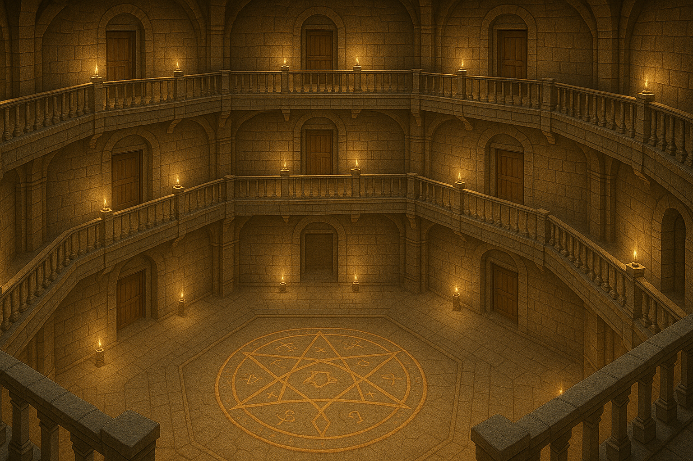
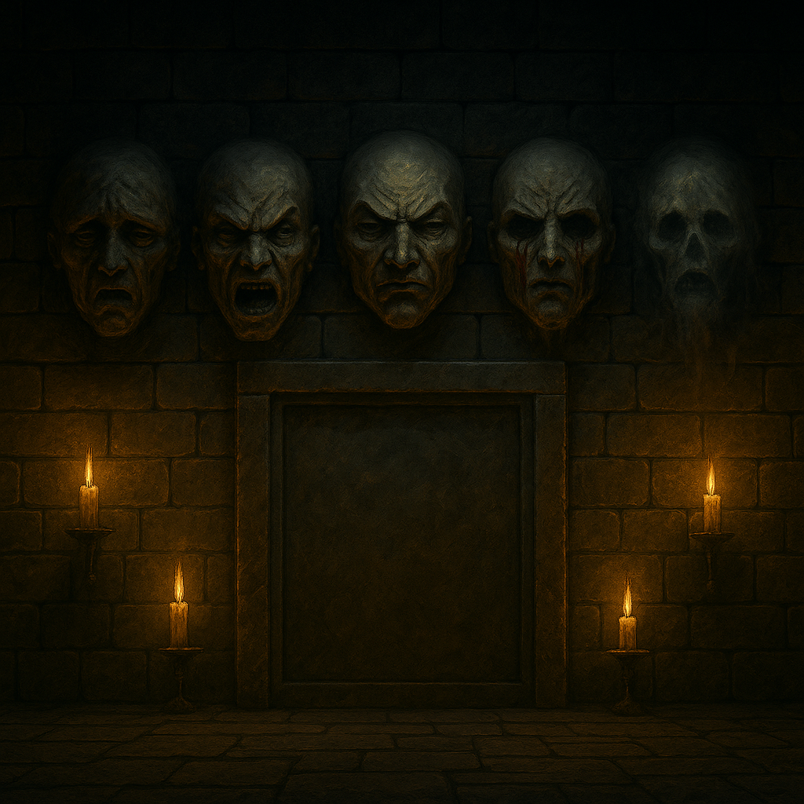
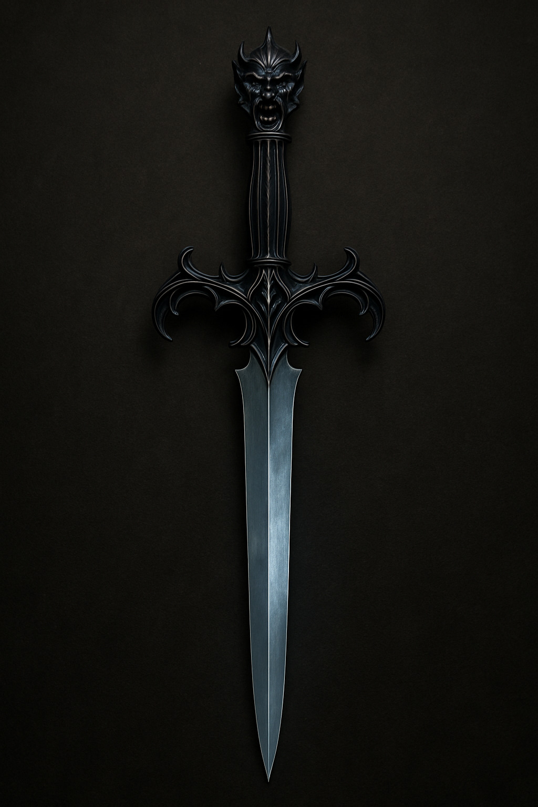

# The vampire, the demons and the dagger

December 17th 1896 - Evening

Having dealt with the Hell Hound Gabriel heads upstairs to grab some blood from the corpse in the hallway, he soaks it up in a sponge from the scullery brings Kyle up to speed after spotting him in the kitchen looking for food, he tells him that Sean has died, Kyle doesn't bring up the sounds of gun fire. Once the sponge is loaded with coagulating blood, they both head back down into the vaults. Having given the sponge to the starving vampire, he tells them his name is Nigel Wheatherston. They quiz him about who and where his alpha is and whether he's still alive. Nigel gives up that his alpha is Vincent Albrect and that the nest is somewhere in Whitechapel. The upcoming world destroying event is discussed, and Nigel is asked if he knows anything about it. When it's clear that Nigel is going to be no more help and looks to be recovering, the vampire aska if he can leave, and whilst being told no actually gets up to leave. He is shot with a silver bullet, falls to the ground and turns to ash.

While this discussion is ongoing, footsteps can be heard on the stone stairs leading down into the vaults. Samuel heads out down the corridor, back to the meeting room, to see what's coming. Gabriel, Kyle and Sean hide either side of the entrance to the room they are in. George grabs the chains and sits down pretending to be Nigel. The two demons, as identified by Samuel with his head peeking out of the wall, walk up to the gate. In the dark now, because all light has been extinguished, they see a figure sat where they expect a figure to be sat and muttering to themselves turn to go. Samuel jumps out behind them and attempts to rip the demon out of his host body, something only a ghost would be able to do. In the ensuing tussle, he manages to rip out the demon but they fight together as white and black smoke tear around the room Samuel takes some psychic damage in the fight but the demon smokes off out up the corridor to the house. The last demon is tripped by Gabriel as he comes back into the store room, scared that way by Samuel's interaction with his mate.

Gabriel trips him up with the barrel of his gun, Sean jumps on top of him to try and hold him down by putting his knee in the demons's back and holding his arms, but the demon is super strong. In the end Kyle jumps on his head and crushes his skull, the demon smokes out and rushes after his friend.

Deciding they need to move quickly, they head back through the meeting room and down the unexplored corridor on the other side. They come up to a stone wall at the end blocking their way, Inscribed into the stone are the words "Prove you are worthy to enter", after investigating the mystery of the blocked passage, they decide that a demonstration of the occult might produce some useful results. Samuel obliges and the inscribed stone door rolls out of the way, grinding on the floor as it does so.

Another short passage to the left comes out on the top floor of a three floored underground hall, pentagonal in shape, with doors along each side and a gallery walk-way around the edges. One door on each floor leads to a stairwell. On the floor at the bottom in a large pentagram magic circle that has been inlaid there in gold. Our boys, Kyle excepted, head straight for it and George investigates to see if it is powerful enough to be used to summon an old one. He thinks it might be.

One of the doors on the bottom floor is missing and instead a large corridor leads off to a strange looking door with a handle and no key, Above the door are 5 faces chiselled out of stone.

Samuel floats up to the fifth mask that looks most like death, it says "I am the mask of the veil, What ties you to this world still — and why do you fear letting go?". Samuel answers honestly that it's the unconcluded mystery of his death that keeps him tethered to this plane. The mask says it is satisfied.

George walks up to the fourth mask and hears "I am the mask of sacrifice, What are you willing to lose to stop what is coming?" George answers honestly that given he was sent from Heaven to save mankind from the threat they face he would give everything. The mask tells him it is satisfied.

Kyle walks up to the third mask and hears, "I am the mask of judgement, What truth about yourself do you hide, even from your allies?" Kyle answers by telling the mask that long ago he made a pact with a god after sacrificing a friend. The mask tells him it is satisfied.

Gabriel walks up to the first mask and hears, "I am the mask of regret, What did you do that you can never undo?", Gabriel tells the mask about the note he forged that ended up getting an innocent reporter harmed. The mask tells him it is satisfied.

Kyle presents himself to the final mask and hears, "I am the mask of fury, Who would you destroy if no one would know?", Kyle answers that he would destroy all the members of **The Cult of the Mythic Dawn**. The mask tells him it is satisfied.

The door opens and they head into the room. It's a reliquary. The floor is black marble, and the room is very dark with more gold inlay but not of any specific symbology that they are aware of. There are piles of used candles, incense shakers, upside down crucifixes for dark masses. There's furniture and books. As well as the piles of bones arranged perfectly in body groups, there are bodies that have been positioned in a precise and methodical way. The bodies are preserved unnaturally, they look like people walked into the corner and committed suicide. In one corner is a horse skull, with cape and antlers, 12" high the very image of Mari Lwyd.

There is a pedestal, made of obsidian, and floating on it is a black dagger.

Samuel is all set to try and move the dagger using magic. Gabriel looks carefully at the pedestal and dagger. Gabriel puts on glove and his hand moves closer and starts to wrap around the handle of the dagger...

## Questions
* Where have the two demons who smoked out gone?
* Will they come back?
* Are the bodies really zombies?
* Are the skeletons really completely dead?
* What happens if you touch the dagger?
* What happens if you take the dagger?

[prev](part-016) - [back to index](index) - [next](part-018)
