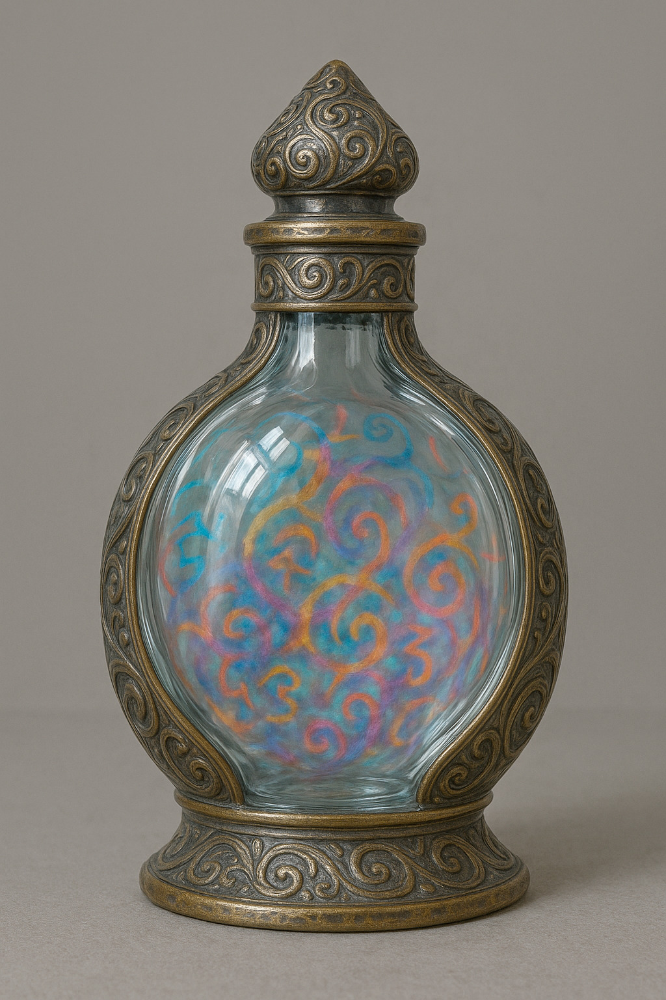

# Off to the circus

December 18th 1896 - Late evening

Sean is with Kyle in the infirmary, chatting with the Dr. George is drinking in the lounge where Gabriel joins him for a chat. Gabriel gets a whisky, asks George what he did with the dagger. It's in Clerkonwell's office. They discuss Gabriel's use of the angel blood and the need to be careful with it. George asks why there was a hand with a dagger and an explanation is given. There is a discussion about the number of lapses that are adding up. Silas on the other hand is in Room 7, one of the secure cells.

Hubert is given a particularly rare mouse and despatched to locate the Imp but the crew's hearts don't seem to be in it. Perhaps now they are working at a world ending level a little Imp isn't as interesting to them. Hubert passes on the message to George from upstairs that the Imp loose is bad and needs his urgent attention.

Gabriel doesn't think they should go after the Imp with all that is going on, and decides to get the dagger back from Clerkonwell and see if proximity to it will help Kyle in some way. George reminds him that urgent means urgent.

In the infirmary, Sean orders bacon... lot's of bacon in order to try and bring Kyle round. The bacon, slices, pancakes, rolls arrives at the same time as Gabriel and George, sporting the dagger, in a hand, in a kidney shaped medical bowl. They try to wake him with the bacon, putting it on his lips. But once the dagger has been liberated from Silas' old hand and wiped with a towel and placed on Kyle's chest after a few minutes he does come round, smells the bacon and asks what's going on. Sean fills him in, as he starts working on the bacon.

Gabriel gets a surreptitious call from C12, is also asked to make the Imp a priority and told that agents will be there to grade him as part of his annual review.

Nobody seems happy about a Chaos Imp being loose in London, Gabriel has heard it from the Foundation, George heard it from upstairs, and everyone heard it from Clerkonwell. The consensus being, get out there and sort it out, we are supposed to keep this stuff hidden, imagine the negative publicity and the questions that will have to be answered if the Imp causes real problems. Also Clerkonwell is not happy about the fire, and wonders aloud how much of London they have burned down.

The team discuss the Imp, Kyle thinks you can put Imps in boxes or other containers. They source a suitable vessel.

With Kyle feeling better they head for Gabriel's newly renovated carriage. meeting Hubert outside, he let's them know that the Imp is causing trouble in Piccadilly Circus. Sean tells them he has remembered to pack the firecrackers. They discuss how to catch the Imp / placate the crowd / or run a distraction. Gabriel tries to convince the crowd who are cowering in doorways and under the overhangs of buildings at the edges of Piccadilly Circus. He fails and get pelted with fruit and veg. Sean has changed into a green santa costume starts telling everyone to go home.

Meanwhile the Imp grabs a child who wanders out into the open. The child is being flown around and is screaming in fright. It puts the child down, and asks where the cult are? The Imp spots George and grabs him instead flying him up into the air. Sean helps out by distracting the Imp with his Santa shenanigans. Samuel also tries to distract the crowd and persuade people to go home. While the Imp is distracted while flying above the fountain, George grabs it teleports to the water of the fountain and at rhe same time blesses the water, bundling the Imp into the water which it takes a very rational dislike to as steam comes off it. Meanwhile Kyle has been casting the spell required to constrain the Imp into the bottle, he completes the spell, the Imp being drawn strongly to the bottle. Once the stopper has been applied, the Imp offers Kyle a wish as Imps in bottle sometimes do. Kyle says "I want to be able to control the dagger with the power of my mind as if I had a hand that can reach out with infinite reach"

Danger averted, George and Sean convince everyone that it was all a performance. Kyle has to sign an autograph for a little girl. Gabriel looks for the two fellas he'd been told would be there. He doesn't see them, but receives a tap on the shoulder and turning sees the two men he'd met before in Kent. There is an awkward chat about the team being good but Gabriel not really helping. "What did you do?" one of them asks. Sean arrives on the scene and commends Gabriel for the excellent planning.

The crew seem to be suspicious of Gabriel, the Foundation really seem to be cramping his style and are in danger of blowing his cover.

George gives a speech in the carriage back to headquarters, what lies ahead... path could be dark... Kyle is asked about his wish and tries to show the dagger levitating. As he moves the dagger forward with his brain, he also moves forward as the dagger leaves his arms length. While doing this he drops the Imp bottle but it's a stout vessel and doesn't smash.

As they dismount from the carriage, the driver voices his displeasure at having to take Gabriel and Gabriel is not happy that the driver hasn't been replaced yet as previously requested. Gabriel passes a note to Hubert, asking him to deliver it to his master. 

> George
> 
> Need to talk. It's important.
> Room 13. Tomorrow Morning 7am sharp.
> Come alone.
> 
> G

## Questions
* What will have happened while the crew have been chasing Imp?
* Is that the end of the trouble from the use of luck getting out of the shop?
* Will Kyles wish be a help or a hindrance?
* Will the Imp be handing out any more wishes?
* What does Gabriel want with George?

[prev](part-020) - [back to index](index) - [next](part-022)