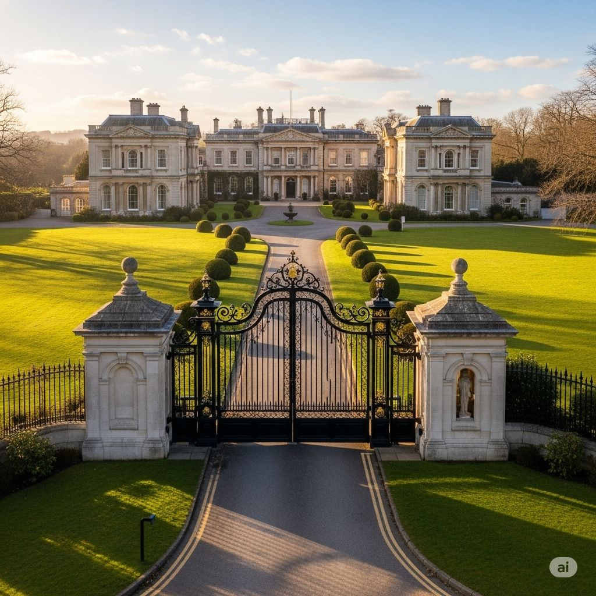

# Dogs now too...

December 19th 1896 - Early morning (7am sharp)

Gabriel and George meet at 7am for their pre-arranged rendezvous. Gabriel walks into room 13 carrying tea, and George whisky. George moans about the early start, Gabriel offers him coffee. George starts with "So what's on your mind?", Gabriel suggests George take a seat and then asks if he can trust him. Gabriel asks if George knows of any other organisations in their line of work, George responds that he knows a few. The discussion moves to the letter, with Gabriel admitting that he hasn't been entirely truthful recently. He says while he's been with the Order for a few years he's been somewhere else far longer. Gabriel also admits that he has his doubts about "the other place", whether they are still acting in the best interests of the world. George asks directly, "Are they in cahoots with the enemy?" Gabriel responds, not all, but a few may be, the note was part of a plan to disrupt the investigation. Gabriel admits that he can't tell George everything but that the other organisation should be on the same side. George says he is grateful for being told, asks how Gabriel wishes to proceed now, and asks who this other organisation is. Gabriel tells him The Foundation, are here to analyse and then to protect. George says he has heard of them, and that they do things differently and that they should have been protected. He is very worried by these revelations. He asks Gabriel if he is in danger. He responds that he will be if they find out I have been speaking to you. Hopefully no one asks! Gabriel adds that he's telling George because tabs are being kept on him and he wants someone to know. George asks if they know about Hubert, Gabriel thinks not. A suggestion is made to ask Hubert to follow, but Gabriel thinks they might take exception, and suggests another chat after this has all been nipped in the bud.

Sean, had been getting drunk at the bar, had even slept at the bar, somehow he wasn't hungover as such. Kyle on the other hand had woken up fighting fit, bounding through the door in his purple stove top hat. Gets straight down to the important business of the day, a large pile of pancakes. Samuel is of course still awake as usual having been about his business or research and light haunting all night, he joins the others.

George starts the conversation, with a soliloquy about how the end of times is approaching with much haste, but the group has been slow, he suggests they go after the Egyptian thing pronto. Sean states that they seem to be very good on side quests. Samuel suggests that all they have done is kick the can down the road. Sean points out that they got the Imp, and a wish out of it, this must be considered a success right? Samuel points out that they did let the Imp go in the first place, but Sean disagrees. Samuel points out that all they did was clear up our own mess. Gabriel cuts in, it's not the score, it's the day wasted. He goes on to point out that they are behind now, that they've met Frostholm and it didn't go well. He's not sure the palace will be able to protect the diamond. Sean suggests that he's getting his knighthood today and this provides the crew with an opportunity, they know where he will be and therefore where he won't be. Kyle, we could go get the jewel, but he thinks they have no chance directly against Frostholm. He isn't sure what he's going to pull, but doesn't want to see the queen get injured as a bystander. Someone jokingly suggests they need a plan for a plan... no one laughs. Gabriel thinks the crown jewels are problematic, he doesn't think the queen will give them up, but also whilst they are secure at the tower, there is nothing stopping Frostholm and goons trying multiple times or going after other stones. Sean is in favour of stealing the jewels and storing them in a safe place. Samuel point out that crown jewels will be hard to steal and are already in a safe location. George thinks Frostholm wouldn't kill the queen, Samuel and Gabriel agree. It might work against him, Queen chosen by God after all. George points out that they could turn up and say the magic words to make Frostholm reveal himself, Gabriel reminds him that last time out, their weapons all ended up on the ceiling. Sean suggests they tie their weapons to their hands, no one is quite sure if he is joking. Sean also suggests giving the Queen the dagger, possibly forgetting what happened to Silas at the Occult book shop. George quickly points this out. Kyle doesn't think it'll work. Sean is therefore convinced and agrees to the plan of going after the tablet. George agrees with Gabriel, if we can't expose him, then get the one thing he doesn't have and then maybe lure him to a location of their choosing. There is a vote, and it's in favour of going after the tablet of the dead.

In preparation they get tooled up, making use of Kyle's armoury.

They pass an uneventful journey to Lord Sterlinghart's mansion in the country. As they approach the gatehouse of the ancestral pile, they discuss their approach given that they had not written ahead to let Sterlinghart know of their coming. The man on the gate, which is shut, asks them what he can do for them. Kyle, waving his big stove top hat says they are on holiday and have come to see some Egyptian relics, mentions the talk that Sterlinghart gave at the society. They are told he's not home. After further discussion a little scamp is sent up to the big house to enquire further. Sean mentions that he has a plan, and Kyle quickly retorts that we'd said we wouldn't burn it down... But he reaches into his jacket and passes Sean a tinderbox, suggesting he only use it if necessary.

Sean and Samuel notice that there are some marks made by the less fortunate that show that food can be acquired here. This may be a way to get in, as there will be other marks to show where entry is possible.

A man walks from the house, with another couple of men beside him and 2 Irish wolf hounds running around. They approach the carriage, the man in front introduces himself as Lord Sterlinghart's steward. Gabriel, doesn't like it and reading what might be a bad situation he gathers that the Steward seems to have two essences in the one body, maybe the others do too. He's also not happy about the dogs and thinks they could be nasty. He suspects the quickest way out is to clear off in the carriage and try again later another way. At this point Gabriel's head is knocked back as he takes a black marble looking thing in the forehead. George just stares, Sean asks Gabriel if he's ok. Gab comes round and telepathically asks Samuel if these are the same as they've seen before, Samuel takes a good look and sees that they are, including the dogs and lets the other know. Sean wonders aloud if they've been beaten to the tablet. George and Gabriel spring out of the carriage. George goes up the the Steward and tries to magically banish the demon, he succeeds and the black smoke of the exorcised demon slinks off towards the house. Bringing the steward around, he tells George that Lord Sterlinghart and his family have been captured and are being held against their will. Sean jumps out and tries to set a fire in a nearby conifer, presumably as a distraction. It makes the demons at the gate pause. Samuel now tries to express a demon from one of the stewards accomplices, he also succeeds. Gabriel starts firing with his shotgun full of salt cartridges, bottling up his feeling as he does so. Sean open fire on one of the dogs, but gets holy water in it's eye. George shouts for everyone to close their eyes, but he's grabbed and thrown against the gate. Gabriel is fighting another demon for control of his gun, the assailant manages to point the gun at George and pull the trigger, the whip-blade comes in handy at this point. Kyle tries to help, but falls getting out of the coach but also pulls out his magnum and puts two into the accomplice. One of the demons tries to take over George, attempting to enter him through his mouth and nose, Samuel floats in try and save George and after an epic spirit fight the smoked out demon also heads off to the house. Kyles distracts one of the dogs with some bacon he just happens to have on him from breakfast, he then pushes over a man and gets out his daggers, both the blessed and the Ravenshade using his mental control ability. One of the men starts running, Gabriel picks up his gun. The fight is over, anyone left standing has run off, men, dogs, scamps the lot. The men including the steward that are no longer possessed start to realise what just happened and are going to need to recover from the experience.

Gabriel shouts "Let's go", they all mount up on the carriage and, gates opened, head down long drive passed the bushes and strange Egyptian artefacts in the garden. The house is large has two wings to either side of a central section where the main door is, the coach pulls up out front and the driver is told he can stay or retire to a safe distance and return later. There is a discussion with the steward, after he's been give some whisky as a pick me up. He asks if they can help Lord Sterlinghart and his family. He tells them that the captives are tied up in the basement. Sean asks if Sterlinghart had talked and the steward says he thinks not. They all decide to get the tablet and secure the release of Lord Sterlinghart.

The decision is to split the party, some will go save Sterlinghart, the steward tells them there is a small priest hole around the back of the house, opposite the church, that leads directly the the basement. The others will head to the church that they are told is used to house some of the collection of Egyptian artefacts. Samuel's plan is to make contact with the ghost he spoke to last time at the Amber's Society and get his help to find the tablet.

## Questions
* Can Gabriel and George actually work together?
* Will the cantankerous Hubert play his part?
* Will Gabriel sort out the problems at The Foundation or will he get chewed up by them?
* Will Kyle eat the Ambers Society out of pancakes?
* Are Sean and Samuel going to fall out?
* What special enemy killing weapon will Kyle find in his armoury?
* How will they approach the house given that whoever is in there know's they are coming?
* Will they find the ghost or the tablet?
* Will they rescue Lord S and his family?

[prev](part-021) - [back to index](index) - [next](part-023)