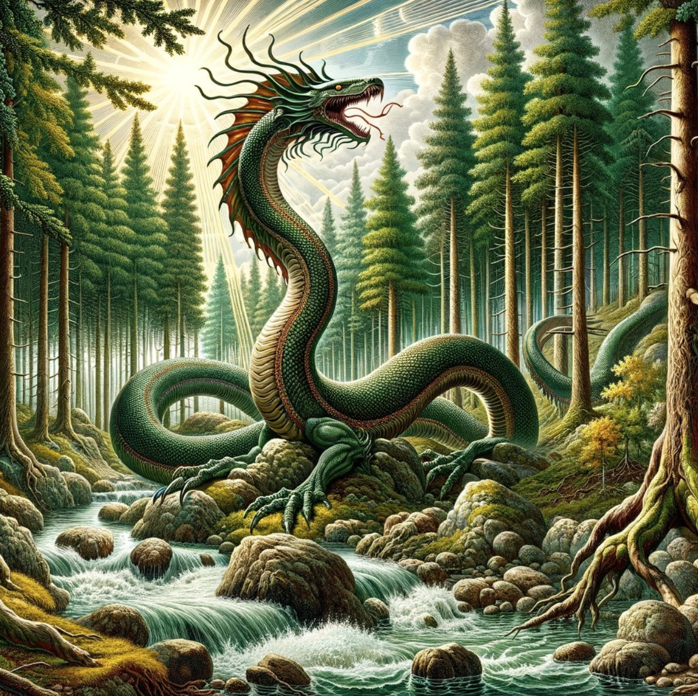
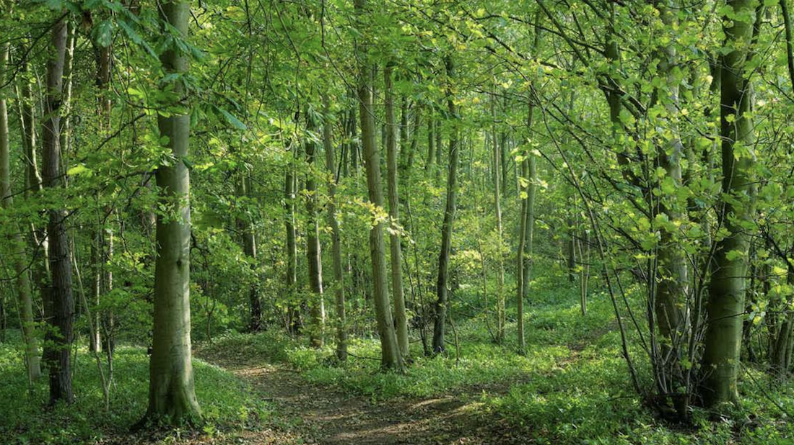
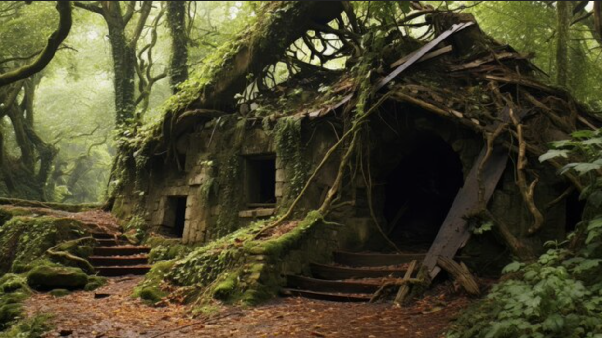

# A Most Harrowing Descent into the Ancient Woodland: Being a Faithful Account of Our Heroes' Perilous Journey to the Lindworm's Lair

December 21th 1896 - Late Afternoon

*As recorded by a humble chronicler in this year of our Lord 1896*

Upon this winter's eve of December the twenty-first, as the clock struck four in the afternoon and darkness settled upon London like a funeral shroud, our intrepid band of investigators found themselves possessed of most peculiar intelligence. The learned scholars of the Order of Veiled Dawn had, during our heroes' supernatural sojourn within the tome of "Italy's Lost Children," prepared extensive documentation regarding the creation of what they had termed an "exploding tablet of demon killing."

The requirements for this infernal device proved most exotic indeed. Two principal ingredients were demanded: the blood of a creature known as a Lindworm, described in the ancient texts as a most formidable serpentine beast possessed of remarkable intelligence and corrosive humours, and a substance referred to as "essence of evil," to be procured from the secretive Hermetic Order of the Golden Dawn.

Gabriel West, that stalwart Professional of the Foundation, though bearing the wounds of recent travails, took command of the situation with characteristic efficiency. "Look," declared he, "what we need to understand about this tablet is that there are several mentions of the holy hand grenade." The revelation that Sean possessed this continent-destroying weapon in his very pocket caused some considerable alarm, particularly when it was understood that this same device was required as a component of their diabolic creation.

The matter of identification between the true and false tablets caused considerable consternation among our heroes. Through much deliberation and the application of string and brown paper, they arranged that the genuine article should be wrapped as a parcel, whilst the counterfeit remained exposed. Samuel Fitzwilliam, that ancient and ethereal scholar, observed with his otherworldly wisdom that once enchanted, both tablets might prove equally difficult to distinguish through supernatural means.

As evening approached, the company made ready for their expedition to Epping Forest, that ancient woodland wherein intelligence suggested a Lindworm might make its lair. Gabriel, ever the professional soldier, took care to bind his wounds through skilled application of medical knowledge, whilst George Banks, that divine warrior, conducted research in the library—though with results that proved less than illuminating, placing Epping Forest somewhere in the vicinity of Devon, a geographical error of spectacular proportions.

Most peculiar was Sean's sudden acquisition of a German Shepherd named Carla, claimed to have been residing in the Order's kennels for some considerable time. This dog, appearing as if from the very aether, would prove instrumental in the evening's adventures, though Gabriel West maintained considerable scepticism regarding both the animal's provenance and Sean's sudden claims of dog ownership.

The journey to Epping Forest proceeded without incident until, upon arrival at that dark and ancient woodland, they encountered a most unusual figure. Standing before a humble hermit's dwelling was a cowled individual introducing himself as "Sisyphus", a name whose pronunciation seemed to carry a peculiar sibilant quality. This mysterious druid, for such he appeared to be, showed no fear whatsoever upon witnessing either the spectral form of Samuel or the divine nature of George's angelic countenance.

"Good evening," spoke Sean with characteristic politeness, "Don't worry. The dog's under control. You wouldn't happen to be the local Lindworm, would you?"
The exchange that followed proved most illuminating. The druid, speaking with that curious lisp, directed them toward an ancient fort upon the hill, warning them to leave the forest as they found it. Gabriel's attempts to discern the man's true nature through supernatural perception proved inconclusive, though the creature's complete lack of concern regarding their supernatural companions suggested experience with otherworldly matters.

Sean's investigation of the hermit's dwelling, conducted under the pretence of offering acorns as a seasonal gift, revealed eyes that gleamed with a distinctly reptilian cast—pupils shaped like an hourglass, yellow and unblinking. When challenged about the Lindworm's identity, the druid maintained his pretence whilst directing them toward the ruins with suspicious eagerness.

The ascent to the ancient fort proved eventful, with encounters both mystical and mundane. First, Samuel's spectral form made contact with a will-o'-the-wisp, that malevolent forest spirit known for leading travelers astray. Through supernatural communication, the entity urged them to "follow," but Samuel's scholarly wisdom recognized the inherent danger. "I don't trust it," declared he with characteristic caution. "Will o' wisps are bad, I think, according to all the poems I've read."

Upon reaching the summit, they discovered the ruins of a small keep, perhaps twenty feet in diameter, its walls tumbled and stones scattered. Gabriel's professional investigation, aided by George's lantern light, revealed stonework worn smooth in a manner suggesting corrosive damage, though whether from natural weathering or supernatural agency remained unclear.
Sean's exploration of the interior, accompanied by faithful Carla, led to the discovery of a most significant feature, a well, like opening in the floor, some two and a half feet in diameter, with sides worn smooth as glass. The edges bore a peculiar rounded quality, and nearby stone showed depressions as if subjected to centuries of acidic dripping, though no source above could account for such erosion.

Samuel, employing his spectral advantages, descended first into this mysterious aperture. His reconnaissance revealed a chamber some fifteen feet square, hewn partially from living rock and partially melted by some unknown agency. Vines grew from the walls and floor, strange vegetation that seemed possessed of predatory intent, whilst glittering objects in the corners suggested the possible presence of treasure, or perhaps merely faceted crystal in the stone.

The scholar's investigation was cut short by the a dusting of mineral salts falling from the ceiling that proved harmful to his ethereal form, causing him considerable distress. "This place is inimical to me," he declared, his spectral voice carrying notes of pain. "I am coming back immediately."

It was at this juncture that George Banks, that divine warrior, suffered an unfortunate mishap. Through circumstances involving previous failed research and the mysterious workings of fate, he found himself precipitated down the well with considerable violence. His descent was marked by collision with rough stones and a final ignominious slide down the smooth lower portion, emerging battered but determined into the underground chamber.

Gabriel West, demonstrating the professional competence that marked his character, executed a descent of remarkable skill and grace. Taking advantage of battlefield experience and employing what he termed "carry forward" momentum, he achieved what could only be described as a superhero landing, his lantern remaining lit throughout the spectacular manoeuvre.

Sean followed with characteristic methodical precision, maintaining three points of contact with the walls and counting his movements with military discipline—though not before concealing the false tablet among the stones above and securing Carla at the entrance as an early warning system.

The underground chamber proved most inhospitable to living visitors. Predatory vines immediately began entwining about their ankles with alarming determination, climbing steadily upward despite their struggles. These botanical assailants showed marked aversion to both flame and bright light, retreating when confronted with George's divine blade or the illumination from their lanterns.

The situation grew increasingly precarious as the vines began to seal the secondary exit—a hole leading deeper into the earth that appeared to have been bored by some creature of considerable size. Gabriel, demonstrating both courage and tactical thinking, deployed his prototype flame-thrower with remarkable precision, creating sufficient heat and light to drive back the aggressive vegetation whilst carefully avoiding igniting the chamber itself.

"Right," declared Gabriel with professional satisfaction, "I told you so. Don't come back. Let's get down the hole."

The wisdom of his action became apparent as the chastened vines retreated entirely, leaving clear passage to the deeper tunnels beyond. The party prepared to venture further into what appeared to be an extensive network of chambers and passages, doubtless the lair of the creature they sought.

As our account draws to its close upon this particular evening's adventures, we find our heroes poised upon the threshold of greater mysteries. The evidence suggests strongly that they have indeed discovered the dwelling place of a Lindworm, though whether the creature itself awaits deeper in the tunnels, or whether it currently masquerades as a helpful druid upon the surface above, remains to be determined.

The challenges ahead appear formidable—narrow passages that may prove problematic for their absent companion Kyle, unknown depths filled with aggressive vegetation, and somewhere in the darkness, a creature of legendary power whose cooperation they must somehow secure. Yet our heroes face these perils with characteristic determination, armed with flame and blade, guided by supernatural wisdom, and united in their desperate mission to prevent the ending of all things.

# Questions for the Next Session:
* Is the mysterious druid "Sisyphus" actually the Lindworm in disguise, or just a very understanding forest hermit who's used to random visitors demanding blood samples?
* How long before Sean accidentally sets off the continent-destroying holy hand grenade while trying to be helpful?
* Will Samuel discover that the underground salt deposits are actually the Lindworm's version of slug pellets specifically designed to deter ghosts?
* Can Gabriel maintain his professional composure when he realizes his flame-thrower fuel won't last long enough to fight every hostile plant in what appears to be a botanical dungeon?
* What are the odds that Carla the suspiciously convenient German Shepherd is actually the most competent member of the party?

[prev](part-033) - [back to index](index) - [next](part-035)